# Instituto Federal de Mato Grosso
Estudante: Ícaro Alencar de Oliveira
Matrícula: 2016178440288
Curso: Engenharia da Computação
Disciplina: Redes de Computadores II

---

# Topologia Frame-Relay e ATM
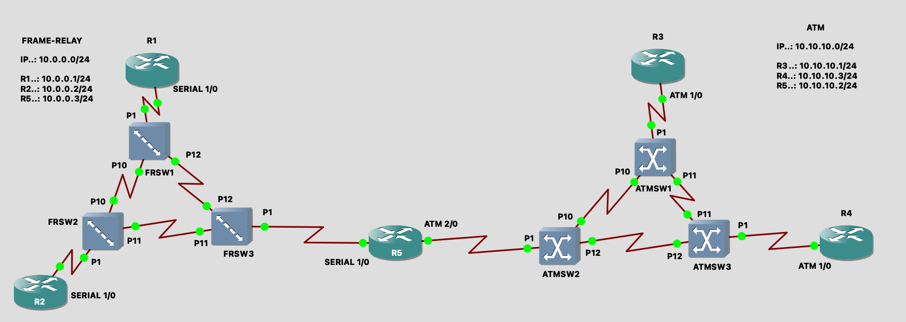

Para que haja comunicação entre os roteadores R1 e R2 e os switches Frame-Relay, é necessário configurar as interfaces dos dispositivos. Inicialmente, as configurações dos roteadores são as seguintes:

# Configuração da rede FRAME-RELAY
Nos Roteador 1 e 2 você precisará ir em Configurações > Slots e no Slot 1 Colocar **PA-4T+**.
Igual as imagens abaixo.

### R1:
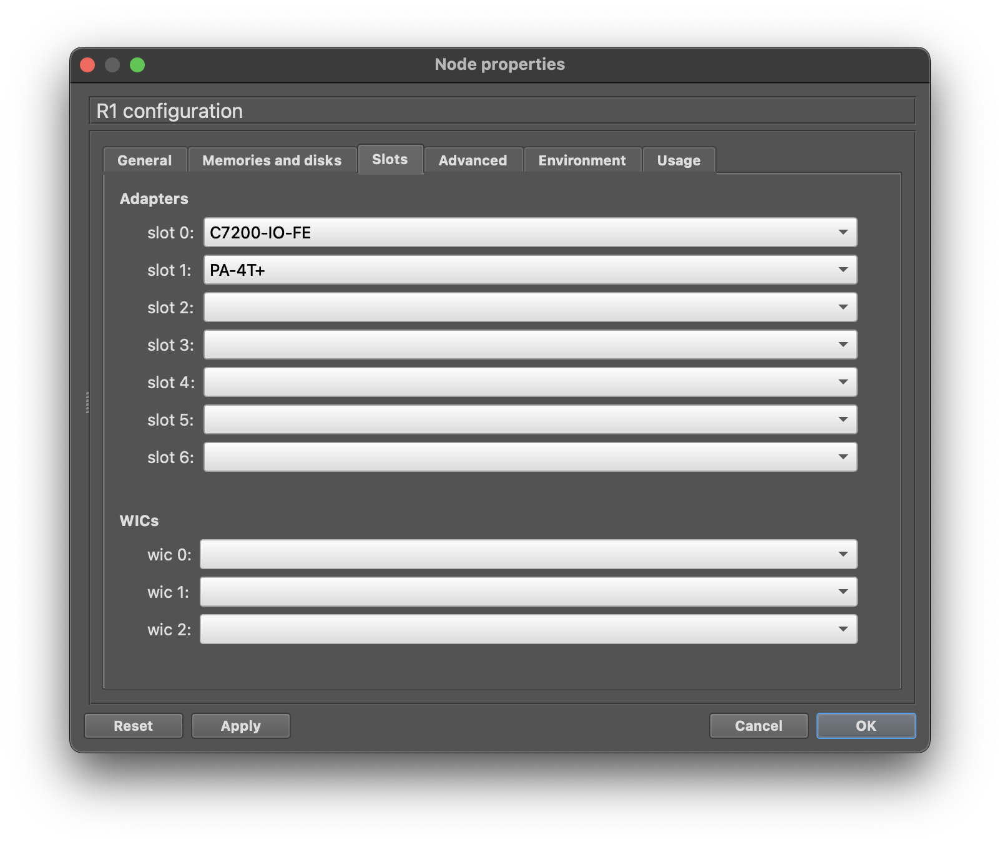

### R2:
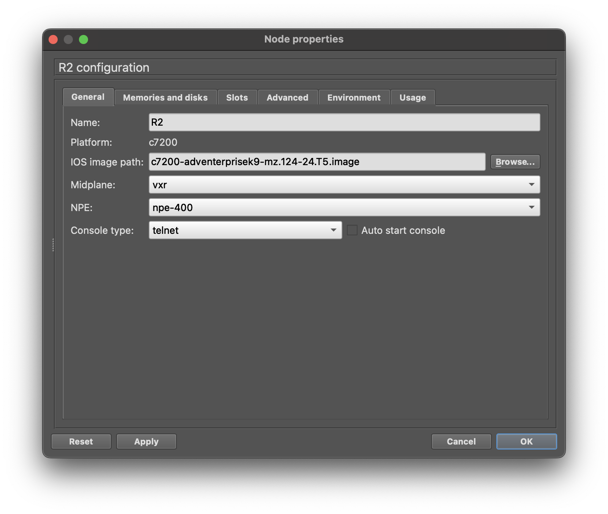

### Configurando os Switch Frame-Relay
### FRSW1:
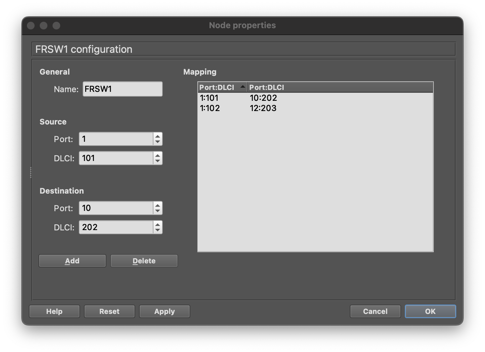

### FRSW2:


### FRSW3:
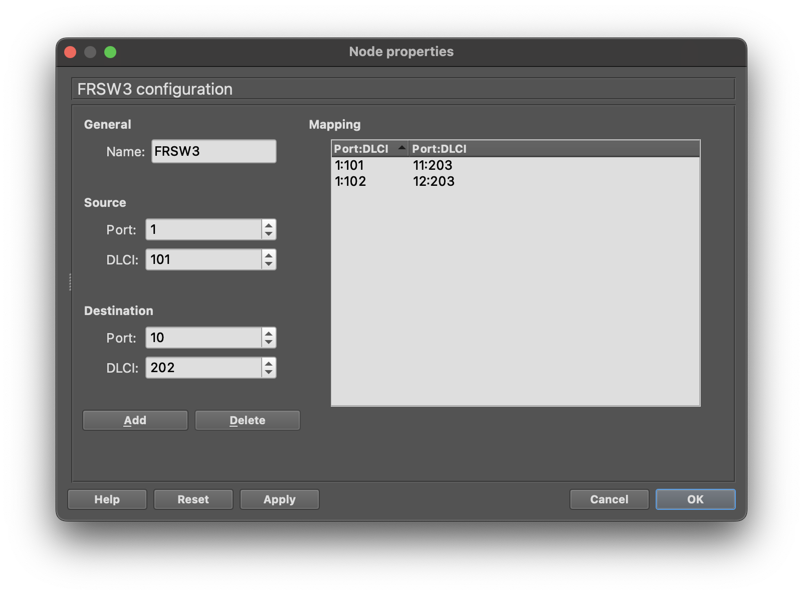

### Configurando os Roteadores.
### R1:
```
configure terminal
int Serial1/0
ip address 10.0.0.1 255.255.255.0
encapsulation frame-relay
frame-relay intf-type dte
frame-relay map ip 10.0.0.2 101 broadcast
no shut
end
```

Após a configuração do R1 digite no console:
```
sh ip int br
```
Deve retornar o seguinte:
### Status:
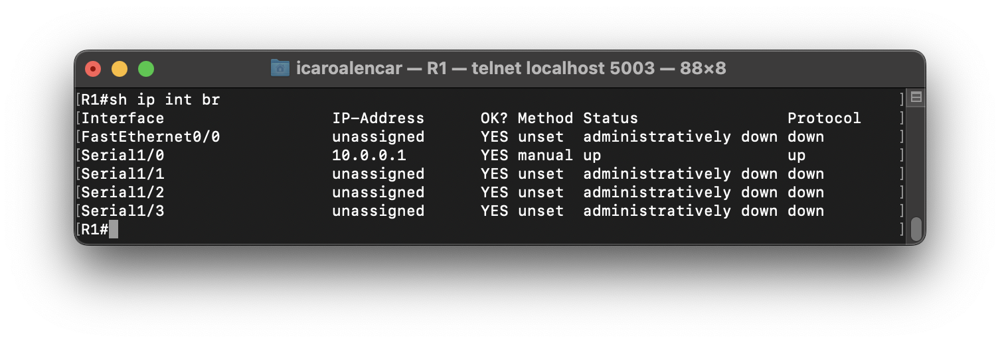

### R2:
```
configure terminal
int Serial1/0
ip address 10.0.0.2 255.255.255.0
encapsulation frame-relay
frame-relay intf-type dte
frame-relay map ip 10.0.0.1 101 broadcast
no shut
end
```

Após a configuração do R2 digite no console:
```
sh ip int br
```
Deve retornar o seguinte:
### Status:
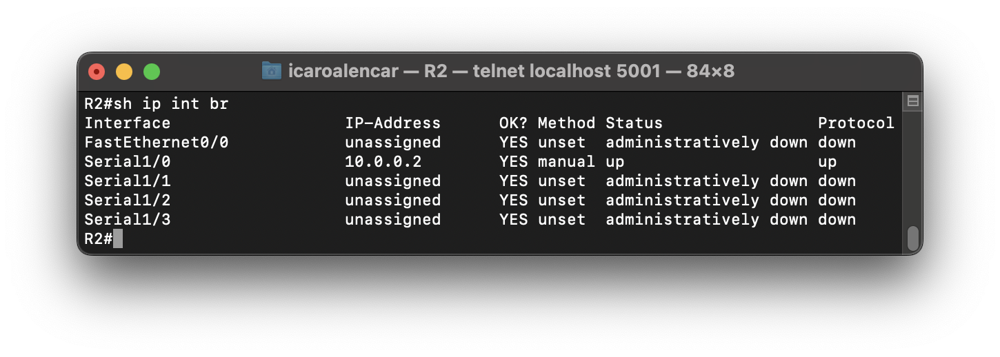

|Nome|Porta|DLCI|Porta|DLCI|
|-|-|-|-|-|
|FRSW1|1|101|10|202|
|FRSW1|1|102|12|203|
|FRSW2|1|101|10|202|
|FRSW2|1|103|11|203|
|FRSW3|1|101|11|203|
|FRSW3|1|102|12|203|

___

# Configuração da rede ATM

Nos Roteador 3 e 4 você precisará ir em Configurações > Slots e no Slot 1 Colocar **PA-A1**.
Igual as imagens abaixo.

### R3:


### R4:


Já a configuração dos switches ATM é como segue:

### ATMSW1:


### ATMSW2:
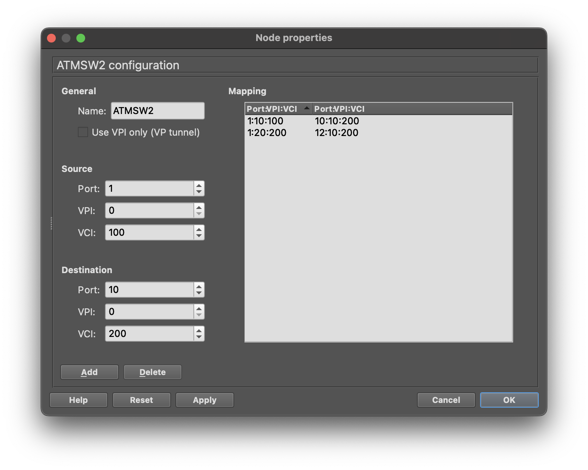

### ATMSW3:


### Configurando os Roteadores.
### R3:
```
configure terminal
int atm1/0
no shutdown
exit
int atm1/0.10 multipoint 
ip add 10.10.10.1 255.255.255.0
pvc 10/100
protocol ip 10.10.10.2 broadcast
encapsulation aal5snap
pvc 11/101
protocol ip 10.10.10.3 broadcast
encapsulation aal5snap
end
```

Após a configuração do R3 digite no console:
```
sh ip int br
```
Deve retornar o seguinte:
### Status:
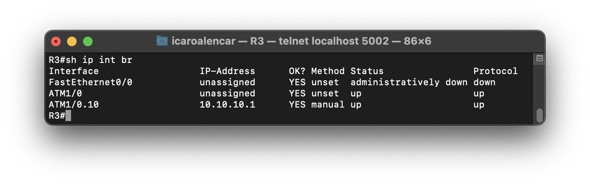

### R4:
```
configure terminal
int atm1/0
no shutdown
int atm1/0.10 multipoint 
ip add 10.10.10.3 255.255.255.0
pvc 11/100
protocol ip 10.10.10.1 broadcast
encapsulation aal5snap
pvc 12/100
protocol ip 10.10.10.2 broadcast
encapsulation aal5snap
end
```

Após a configuração do R4 digite no console:
```
sh ip int br
```
Deve retornar o seguinte:
### Status:


|Name|Port|VPI|VCI|Port|VPI|VCI|
|-|-|-|-|-|-|-|
|ATMSW1|1|10|100|10|10|200|
|ATMSW1|1|11|101|11|11|201|
|ATMSW2|1|10|100|10|10|200|
|ATMSW2|1|20|200|12|10|200|
|ATMSW3|1|11|100|11|11|201|
|ATMSW3|1|12|100|12|10|200|

# Configurando Roteador 5
No Roteador 5 você precisará ir em Configurações > Slots e no Slot1 coloque **PA-4T+** e no Slot 2 coloque **PA-A1**.
Igual a imagem abaixo.
### R5:
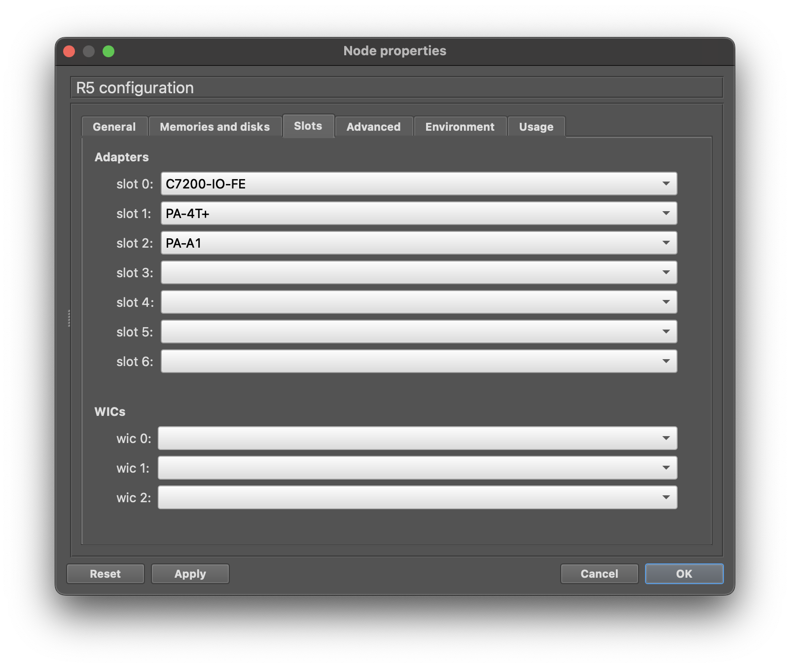


### Interface Serial Frame-Relay:
```
configure terminal
int Serial1/0
ip add 10.0.0.3 255.255.255.0
encapsulation frame-relay
frame-relay intf-type dte
frame-relay map ip 10.0.0.2 101 broadcast
frame-relay map ip 10.0.0.1 102 broadcast
no shut
end
```

### Interface ATM:
```
configure terminal
int atm2/0
no shutdown
int atm2/0.10 multipoint 
ip add 10.10.10.2 255.255.255.0
pvc 10/100
protocol ip 10.10.10.1 broadcast
encapsulation aal5snap
pvc 20/200
protocol ip 10.10.10.3 broadcast
encapsulation aal5snap
end
```

Após a configuração do R5 digite no console:
```
sh ip int br
```
Deve retornar o seguinte:
### Status:
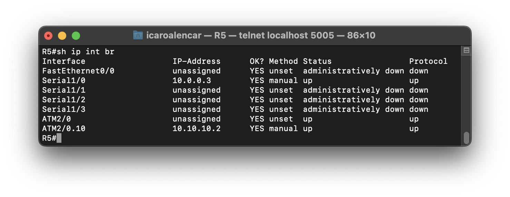

# RESULTADOS
```
IPs...

Frame-Relay
R1...: 10.0.0.1
R2...: 10.0.0.2

ATM
R3...: 10.10.10.1
R4...: 10.10.10.3

R5_Serial...: 10.0.0.3
R5_ATM......: 10.10.10.2
```
## Pingando...
### R1 TO R2:
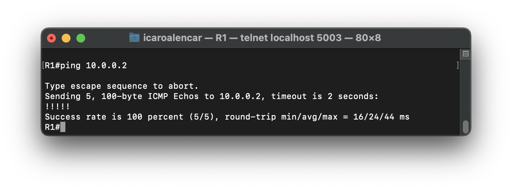

### R1 TO R5:
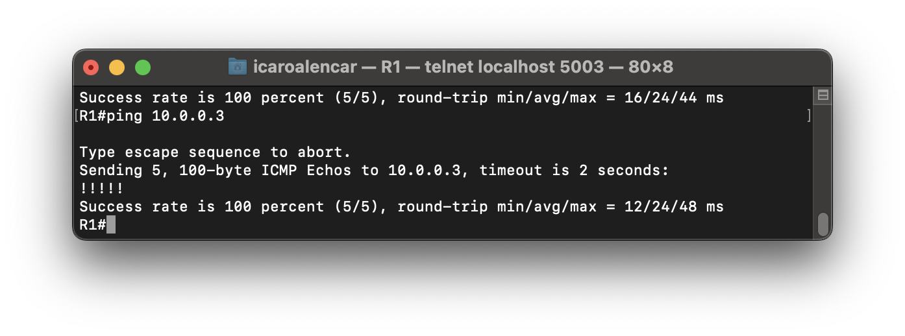

### R2 TO R1:
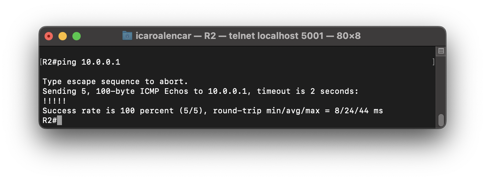

### R2 TO R5:
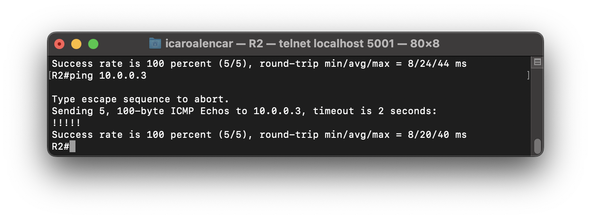

### R3 TO R4:
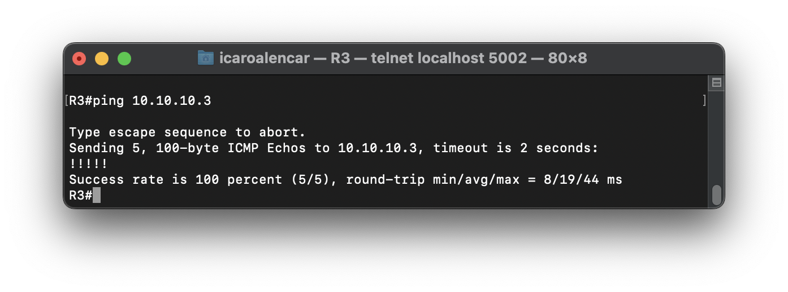

### R3 TO R5:


### R4 TO R3:
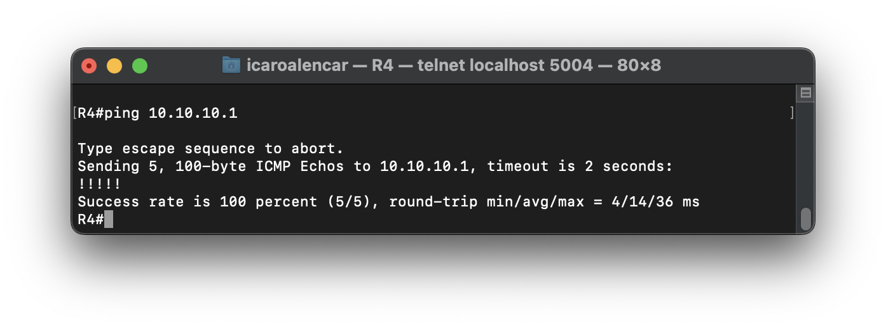

### R4 TO R5:
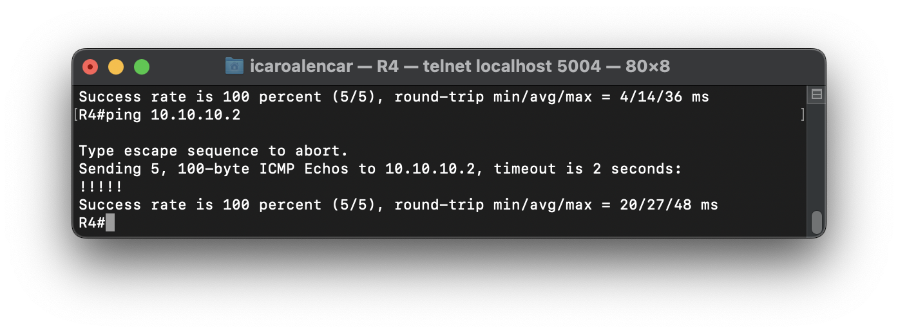

### R5 TO R1:
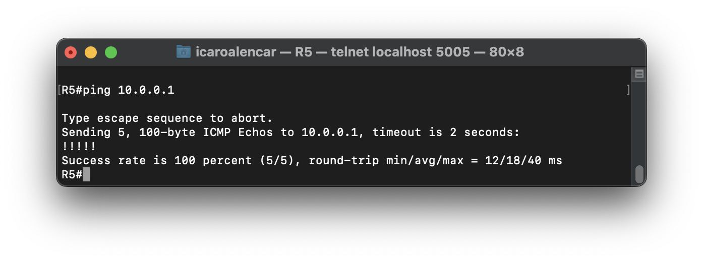

### R5 TO R2:


### R5 TO R3:
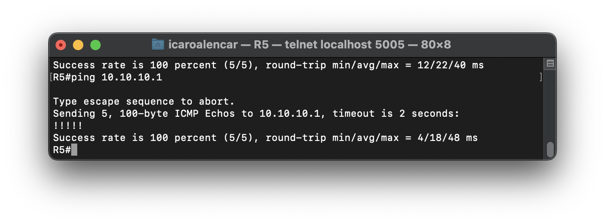

### R5 TO R4:
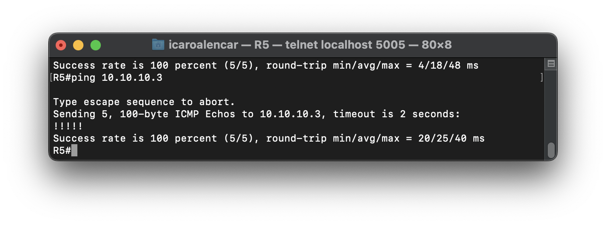
